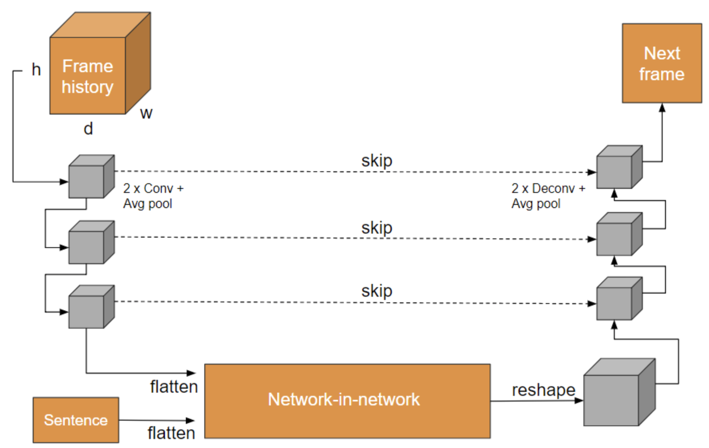

# Videogeneration

### About
In this project, we present a variety of deep learning based setups for text to image and text to image sequence generation. Image sequence generation is a challenging task and an actively researched branch within computer vision, posing special challenges such as temporal coherency. To address this problem, we describe a variety of partial and complete solutions that we developed in three stages: (1) Text to Image Synthesis: using a traditional GAN, we generate a single image from a textual representation. (2) Text + Image to Video Synthesis: using a fully convolutional network, we generate an image sequence given a single frame and a description of the action taking place. Inspired by the recent success of generative adversarial networks, we then also train this architecture in a truly adversarial setting. 

We perform experiments on our synthetic icon and MNIST datasets, as well as the KTH Human Action Dataset for walking. To train our network, we feed in the textual annotation, the current frame and up to 9 preceding frames, if available. The network is then trained to output the next frame. During inference, we just provide an initial frame and the textual description to predict the new frame, and then repeatedly feed in the previous predictions to predict further into the future. In the result section below, we execute this prediction cycle for between five and ten times, but it can be followed an indefinitely number of times.

### Network Architecture 
Inspired by the success of U-Net, an encoder-decoder architecture with skip-connections proposed for biomedical segmentation, we adapt a similar base structure for our problem. We extend U-Net to operate on 3D-volumes instead of single images as input. A 3D-volume here represents previous frames in the GIF sequence. We then incorporate the text captions by embedding a network-in-network: the encoder first transforms the input volume into a compact latent representation. We flatten the resulting volume and feed it into a series of densely connected layers. We also feed in a caption representation at this point. The output of this “network-in-network” is reshaped to a 3D-volume, and subsequently upsampled by the decoder. Our output is a single image which represents the next frame.

A graphical representation of our network is shown above. The idea behind the structure is as follows: given the current frame and history, we first use the encoder structure to get a condensed representation of the image contents. Once in it, through our use of fully-connected layers in our internal network, we have a high level of expressiveness to manipulate image contents based on the image inputs. However, once it is manipulated, we are left with a highly downsampled and low-quality image. Here, the decoder comes into play and the skip-connections render themselves crucial: through them, the upsampling can re-include lost detail in the images to produce high-quality outputs. Following this logic, we can think about our encoder as bringing our input to a higher-level, more abstract representation, our network-in-network architecture as image transformer, and our decoder as quality and detail enhancing entity.

We perform experiments on our synthetic icon and MNIST datasets, as well as the KTH Human Action Dataset for walking. To train our network, we feed in the textual annotation, the current frame and up to d - 1 preceding frames, if available. The network is then trained to output the next frame. During inference, we just provide an initial frame and the textual description to predict the new frame, and then repeatedly feed in the previous predictions to predict further into the future. In the result section below, we execute this prediction cycle for between five and ten times, but it can be followed an indefinitely number of times.

We reached convergence within a few minutes, but found our architecture to be prone to overfitting, which we resolved through increased regularization. For our experiments, we set h = w = 64 for synthetic data and h = w = 128 for the activity data. We always choose d = 10, which is a reasonable amount of history available for the network. Our sentences are simply represented as one-hot encoded matrices. We show some qualitative results below.

### Adversarial Setup

In an attempt to increase our network’s generalization performance, we added a discriminator network at the end of our frame-generating U-Net network. The idea here is as follows: we want to imitate movement in a realistic manner, but that doesn’t necessarily mean that we need to perfectly reproduce the frames of our training set. In fact, as long as the generated frame is temporally coherent and consistent with the caption, we accept it as a valid frame. When the problem is phrased like this, it becomes less obvious what the best loss function is. In fact, MSE might not be the best choice, as it draws the network towards reproducing as best as possible the training example -  this somewhat over-constraints the output, and that leads to difficulty in training and overfitting. 

In this situation, a discriminator could work well, as it may be thought as a network approximating a loss function. That is due to the adversarial setting, as explained in the introduction: we build a network to recognize real frames from fake ones, and that drives the network to output a measure of “validity” of any input frame. That validity is directly based on the real examples that were shown to the discriminator, and is therefore a dynamically changing loss adapted to the data we want to reproduce.

We added a discriminator working at a frame level as shown below. 

Below are some results obtained with U-Net + discriminator. As can be seen, the results are positive and the movement of a person is correctly captured by the generator. We observe that although the images are still lacking high-resolution detail, we are able to generalize positively to the test set.

