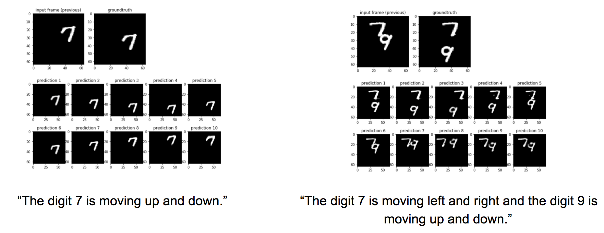

# Videogeneration

In this project, we present a variety of deep learning based setups for text to image and text to image sequence generation. Image sequence generation is a challenging task and an actively researched branch within computer vision, posing special challenges such as temporal coherency. To address this problem, we describe a variety of partial and complete solutions that we developed in three stages: (1) Text to Image Synthesis: using a traditional GAN, we generate a single image from a textual representation. (2) Text + Image to Video Synthesis: using a fully convolutional network, we generate an image sequence given a single frame and a description of the action taking place. Inspired by the recent success of generative adversarial networks, we then also train this architecture in a truly adversarial setting. 

